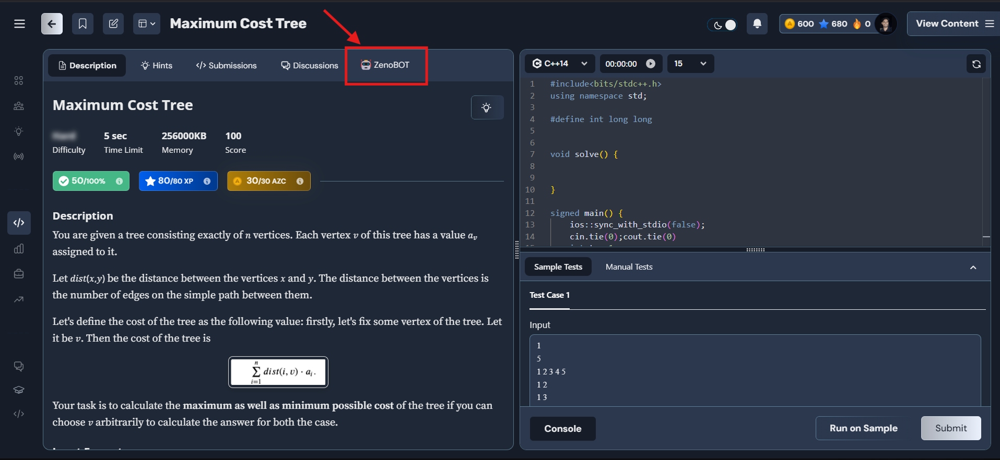
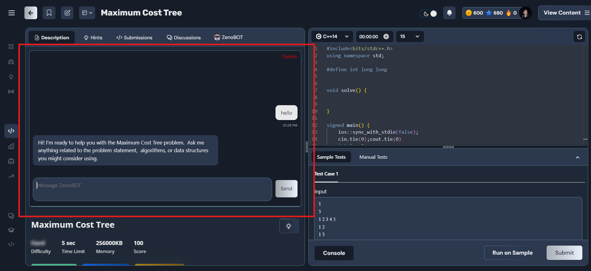
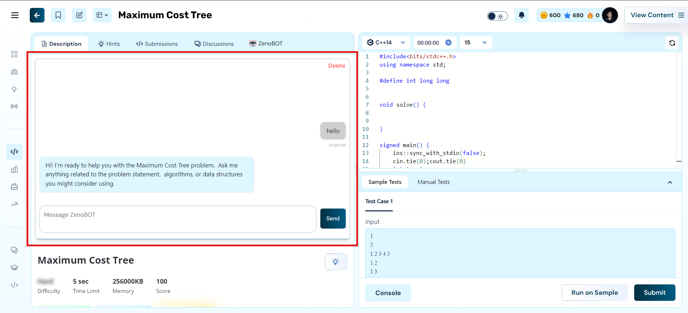

# 🚀 **ZenoBOT: Your AI Problem-Solving Companion for AlgoZenith**

**ZenoBOT-AlgoZenith-AI-Helper-Bot** is a feature-packed Chrome extension designed to elevate your experience on the AlgoZenith platform. Whether you’re solving complex coding problems or debugging errors, ZenoBOT offers personalized hints, customizable themes, chat history, and much more—all seamlessly integrated into your workflow.

---

## 🌟 **Key Features**

### 🔹 **Smart Problem Assistant**
- Get personalized hints and tailored guidance for solving problems on AlgoZenith.  
- Designed to help you progress step-by-step without revealing full solutions.

### 🔹 **Theme Customization**
- Switch between **Light Mode** and **Dark Mode** to suit your environment and preferences.  
- Enhance readability while reducing eye strain.

### 🔹 **Resizable Chat Box**
- Adjust the chat box size effortlessly to match your workspace.  
- Experience ultimate comfort while interacting with the bot.

### 🔹 **History Tracking**
- Save and revisit your past queries and responses automatically.  
- Keep track of your learning journey and problem-solving efforts.

### 🔹 **Error Debugging Support**
- Paste error messages directly into the chat box and receive debugging suggestions.  
- Fix issues faster and with confidence.

### 🔹 **Interactive and User-Friendly Design**
- Intuitive interface for seamless interaction with the AI bot.  
- Simplified navigation for a smoother experience.

---

## 🖼️ **Screenshots**

| **Feature**                | **Preview**                                  |
|----------------------------|----------------------------------------------|
| ZenoBOT                    |  |
| Dark Theme Chat Interface  |           |
| Light Theme Chat Interface |          |

---

## 🎥 **Live Demo**

👉 **[Watch Demo Video]()**  

See ZenoBOT in action and discover how it can transform your AlgoZenith experience.

---

## ⚙️ Installation and Setup

### For Users

1. Download the extension from the [Chrome Web Store](#).
2. Click on "Add to Chrome" to install.
3. Access the bot via the extension icon in your Chrome toolbar.

### For Developers

1. Clone the repository:
   ```bash
   git clone https://github.com/your-username/ZenoBOT-AlgoZenith-AI-Helper-Bot.git
   ```
2. Navigate to the project directory:
   ```bash
   cd ZenoBOT-AlgoZenith-AI-Helper-Bot
   ```
3. Load the extension in Chrome:
   - Open Chrome and navigate to `chrome://extensions/`.
   - Enable "Developer mode".
   - Click "Load unpacked" and select the project folder.
4. Run the development server (if applicable):
   ```bash
   npm install
   npm start
   ```

---

## 🛠️ Usage

1. Open the AlgoZenith website.
2. Activate ZenoBOT by clicking on the Chrome extension icon.
3. Interact with the AI bot by typing your queries in the chat box.
4. Customize themes and chat box size through the settings menu.
5. Review your chat history anytime for saved solutions.

---

## 💻 Technologies Used

- **Frontend**: HTML, CSS, JavaScript
- **Backend**: Node.js (for AI integrations)
- **Chrome Extension APIs**

---

## 🌍 Contributing

We welcome contributions to improve ZenoBOT! To contribute:

1. Fork the repository.
2. Create a new branch:
   ```bash
   git checkout -b feature-name
   ```
3. Commit your changes:
   ```bash
   git commit -m "Add new feature"
   ```
4. Push the branch:
   ```bash
   git push origin feature-name
   ```
5. Create a pull request.

---

## 📜 License

This project is licensed under the MIT License. See the LICENSE file for details.

---

## 📧 Contact

Have questions, feedback, or need help? Reach out:

📩 Email: guptaankit1640@gmail.com

---

## 🌟 Start solving problems smarter and faster with ZenoBOT-AlgoZenith-AI-Helper-Bot!
## ✨ Install now and level up your coding journey.

